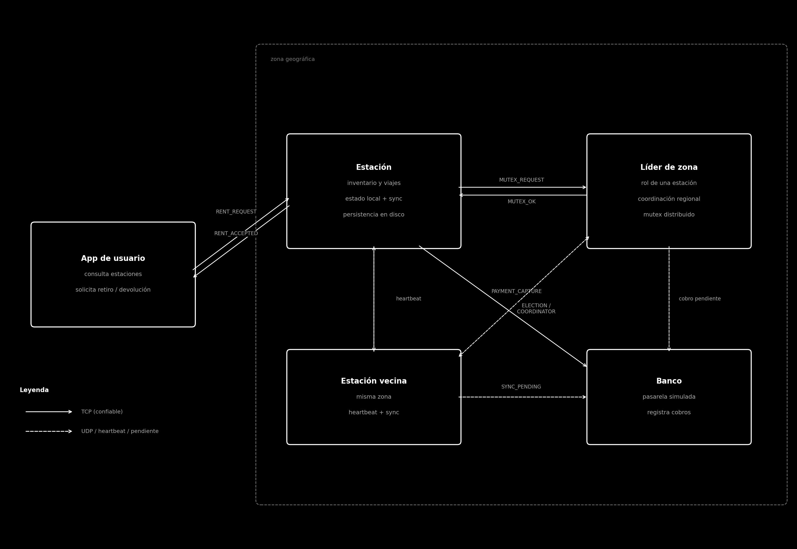
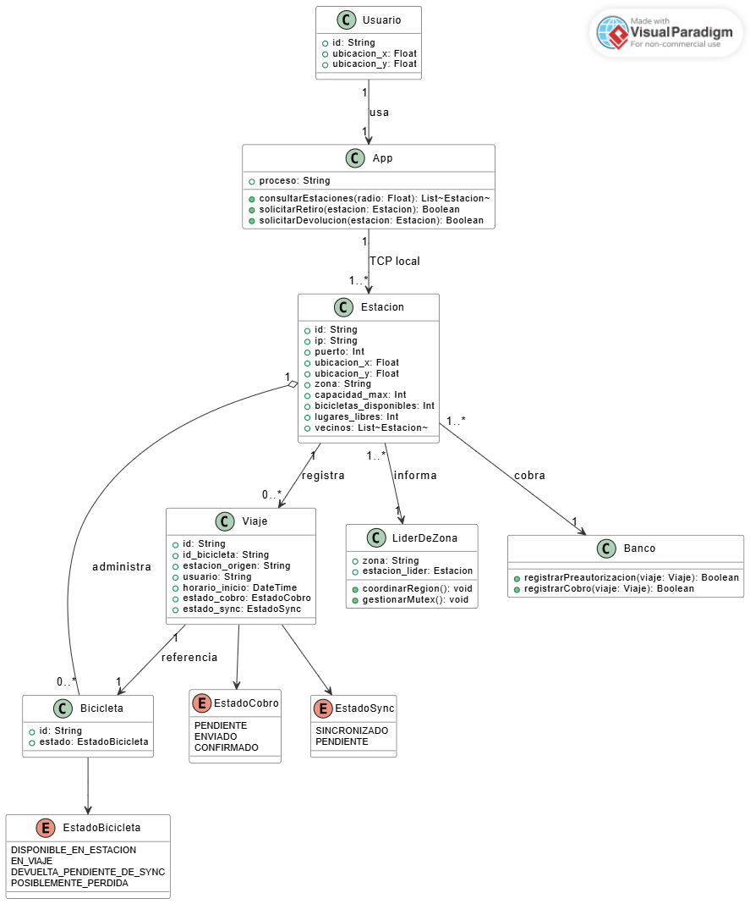

# Trabajo Practico - Alquiler de bicicletas

## Estado del documento

Esta es la primera entrega de diseno. La intencion es validar la arquitectura general y las decisiones principales antes de avanzar con la implementacion. Acompana un esqueleto minimo en [tp_bicicletas/](tp_bicicletas/) con los structs de estado y mensajes ya definidos.

## Descripcion general

El sistema modela una red de estaciones para alquiler y devolucion de bicicletas. Cada estacion es un proceso independiente, mantiene su estado local y puede seguir operando aun cuando pierda conectividad con el resto.

La app de usuario tambien es un proceso separado. Su funcion es consultar estaciones cercanas y pedir retiros o devoluciones a una estacion local. La comunicacion entre app y estacion la modelamos con sockets TCP, como abstraccion de la cercania fisica.

El sistema no confia en la app como fuente de verdad: quien registra el inicio y el fin de un viaje es la estacion. Esto evita depender de que el usuario informe honestamente horarios o devoluciones.

## Zonas geograficas

La ciudad se divide en zonas. Cada estacion tiene ubicacion `(x, y)` y pertenece a una zona configurada. Esto reduce mensajes distribuidos: una estacion no informa cada cambio a toda la ciudad, sino principalmente a las estaciones cercanas o al lider de su zona.

Cuando un usuario consulta disponibilidad, la app busca dentro de un radio. Si no encuentra estaciones, el radio se amplia. Una estacion puede aparecer como cercana aunque este desconectada; en ese caso la app puede mostrar su ultimo estado conocido, aclarando que podria estar desactualizado.

## Descubrimiento de estaciones

El descubrimiento no es el foco del trabajo. Se resuelve por configuracion: al arrancar, cada proceso lee un archivo con id, ip, puerto, ubicacion, zona, capacidad maxima y vecinos. Hay un ejemplo en [tp_bicicletas/config/station.cfg](tp_bicicletas/config/station.cfg).

La cantidad de estaciones es constante; durante la ejecucion se pueden matar y volver a levantar procesos, pero no se crean estaciones nuevas dinamicamente.

## Procesos del sistema

El sistema tiene cuatro tipos de proceso:

- **App de usuario**: consulta estaciones y pide retiros o devoluciones.
- **Estacion**: administra bicicletas, valida operaciones, sincroniza con el lider y el banco.
- **Lider de zona**: rol que asume una estacion de la zona. Coordina informacion regional y exclusion mutua.
- **Banco**: pasarela de pagos simulada.

No hay servidor central. Cada zona tiene su lider, elegido entre las estaciones. Si el lider cae, se ejecuta una eleccion y otra estacion asume el rol.





## Entidades

### Estacion

Es la entidad central. Administra fisicamente las bicicletas que tiene, valida retiros y devoluciones contra su estado local, registra los viajes que se inician desde ella y sincroniza con el lider y con el banco.

Estado interno aproximado (pseudocodigo de Rust, definido en [src/station.rs](tp_bicicletas/src/station.rs) y [src/types.rs](tp_bicicletas/src/types.rs)):

```rust
struct Station {
    config: StationConfig,
    bicicletas: HashMap<BikeId, Bicicleta>,
    viajes_activos: HashMap<TripId, Viaje>,
    operaciones_pendientes: Vec<OperacionPendiente>,
    lider_actual: Option<StationId>,
}
```

Mensajes que recibe:

- de la app: `DiscoverRequest`, `RentRequest`, `ReturnRequest`.
- del lider: `RegionalStateUpdate`, `MutexOk`.
- de otras estaciones de la zona: `TripCompleted`, `Heartbeat`, mensajes de eleccion (`Election`, `OkElection`, `Coordinator`).
- del banco: `PaymentAck`.

Mensajes que envia:

- a la app: `DiscoverResponse`, `RentAccepted` / `RentRejected`, `ReturnAccepted` / `ReturnRejected`.
- al lider: `TripStarted`, `TripCompleted`, `MutexRequest` / `MutexRelease`, `SyncPending`, `Heartbeat`.
- a los vecinos: mensajes de eleccion (`Election`, `OkElection`, `Coordinator`).
- al banco: `PaymentPreauth`, `PaymentCapture`.

Los structs concretos del payload de cada mensaje estan en [src/messages.rs](tp_bicicletas/src/messages.rs).

Protocolos: TCP para todo lo que requiere respuesta confiable (retiros, devoluciones, viajes, mutex, cobros, mensajes de eleccion). UDP para heartbeats, donde se tolera perdida puntual. El formato de aplicacion va a ser texto plano simple (`KIND|k=v|k=v`), sin crates externos.

Casos:

- **Feliz**: la app pide retiro; la estacion valida, registra el viaje, avisa al lider, pre-autoriza al banco y responde aceptado.
- **Sin conectividad externa**: la estacion responde igual porque la disponibilidad fisica la sabe localmente; encola la operacion y el cobro como pendientes, y los sincroniza al volver la conexion.
- **Caida y reinicio de la estacion**: el estado local se persiste en disco para recuperarlo al volver a levantarse.

Internamente la estacion va a implementarse con modelo de actores: un actor coordinador (con el estado principal) apoyado en actores auxiliares para red, inventario, eleccion, exclusion mutua, cobros y persistencia, comunicados por canales `mpsc`. En este esqueleto solo dejamos los structs; la separacion concreta en actores se cierra en la implementacion.

### App de usuario

Reenvia intenciones del usuario a una estacion cercana. No es fuente de verdad: solo guarda referencias locales como "tengo un viaje en curso con tal bici".

Estado:

```rust
struct App {
    config: AppConfig,
    usuario: UserId,
    ubicacion: Coord,
    viaje_en_curso: Option<(TripId, BikeId, StationId)>,
}
```

Recibe: `DiscoverResponse` y las respuestas `Accepted` / `Rejected` de la estacion.
Envia: `DiscoverRequest`, `RentRequest`, `ReturnRequest`.

Protocolo: TCP local a la estacion cercana. Si una estacion no responde, intenta con otra del radio.

Caso feliz: la estacion responde aceptado y la app guarda el `TripId` para asociarlo a la devolucion. Caso de fallo: si la estacion no responde, la app reintenta con otra; si ninguna responde, informa al usuario.

### Lider de zona

Es un rol que asume una estacion de la zona (la de mayor id viva, segun Bully), no un proceso aparte. Concentra:

- la vista regional de disponibilidad,
- la coordinacion de mutex distribuido para operaciones criticas regionales,
- la recepcion de viajes iniciados y cerrados,
- el procesamiento de `SyncPending` cuando una estacion recupera conectividad.

Recibe: `TripStarted`, `TripCompleted`, `MutexRequest`, `MutexRelease`, `SyncPending`, `Heartbeat`, mensajes de Bully.
Envia: `RegionalStateUpdate`, `MutexOk`, `Coordinator` (al ganar la eleccion), y reenvia `TripCompleted` a la estacion origen del viaje.

Si el lider deja de responder a heartbeats, las estaciones disparan una nueva eleccion. Las solicitudes de mutex que estaban en vuelo se reintentan contra el nuevo lider.

### Banco

Pasarela de pagos simulada. Recibe `PaymentPreauth` o `PaymentCapture`, registra la operacion y responde `PaymentAck`. No modela saldos ni rechazos: el foco esta en la comunicacion distribuida, no en logica bancaria.

Estado:

```rust
struct Bank {
    operaciones: HashMap<TripId, OperacionBanco>,
}
```

Si recibe la misma operacion dos veces (por reintentos), no la duplica: usa el `trip_id` como clave. Solo TCP.

## Estados que manejamos

Bicicletas:

- `DisponibleEnEstacion`: fisicamente en una estacion, lista para retirar.
- `EnViaje`: retirada por un usuario, todavia no devuelta.
- `DevueltaPendienteDeSync`: devuelta en una estacion sin conectividad.
- `PosiblementePerdida`: viaje abierto mas alla de un umbral configurable.

Operaciones pendientes que se acumulan cuando no hay conectividad:

- retiros sin informar al lider,
- devoluciones sin informar al lider,
- cobros sin enviar al banco,
- actualizaciones de disponibilidad pendientes.

Para tolerar reinicios, cada estacion persiste su estado local en archivos simples (bicicletas, viajes activos, operaciones pendientes).

## Herramientas de concurrencia distribuida

Usamos dos.

**Eleccion de lider (Bully)** entre las estaciones de una zona. Si el lider no responde, una estacion inicia eleccion enviando `Election` a las de id mayor; si nadie responde, se proclama lider y anuncia `Coordinator`. Si responde alguno mayor, ese sigue la eleccion. Elegimos Bully porque las zonas son chicas y el conjunto de estaciones esta definido por configuracion, asi que cada estacion conoce a las otras.

**Exclusion mutua distribuida centralizada** con el lider como coordinador. Se usa para operaciones criticas del estado regional (actualizar la vista de disponibilidad, cerrar viajes que tocan varias estaciones, sincronizar operaciones pendientes). No se usa para decidir si una bicicleta esta fisicamente en una estacion: eso es autoridad local.

Si una estacion no puede contactar al lider, prioriza la operacion local y la registra como pendiente. Esto implica consistencia eventual: el estado local es inmediato, la vista regional puede tardar en converger.

## Casos de interes

**Retiro feliz**: la app consulta estaciones cercanas, el usuario elige una con bicis disponibles, la app pide retiro, la estacion valida distancia y disponibilidad, registra el viaje, avisa al lider, pre-autoriza al banco y responde aceptado.

**Devolucion feliz**: el usuario llega a una estacion con lugar, la app pide devolver, la estacion valida capacidad, registra la devolucion, avisa al lider y envia el cobro al banco.

**Retiro o devolucion sin conectividad externa**: la estacion responde igual porque la disponibilidad fisica es local. Encola la operacion como `OperacionPendiente` y el cobro tambien. Cuando vuelve la conexion, sincroniza.

**Caida del lider**: las estaciones detectan que el lider no responde, disparan Bully, eligen nuevo lider y le reenvian operaciones pendientes.

**Bicicleta no devuelta**: si un viaje permanece abierto mas tiempo del umbral configurado, se marca la bicicleta como `PosiblementePerdida` y el estado se sincroniza en la zona.

## Como ejecutar el esqueleto

```bash
cd tp_bicicletas
cargo build

# en distintas terminales:
cargo run -- bank
cargo run -- station config/station.cfg
cargo run -- app
```

El mismo binario corre cualquiera de las tres entidades segun el primer argumento. Para levantar varias estaciones basta usar archivos de configuracion distintos.

## Decisiones pendientes para validar

- Si Bully + exclusion mutua centralizada alcanza como uso de herramientas distribuidas.
- Si la consistencia eventual propuesta para operaciones offline es aceptable.
- Si alcanza con implementar el modelo de actores principalmente dentro de la estacion.
- Si el formato de mensajes propio (texto plano sin crates externos) es aceptable.
- Si el umbral para marcar bicicletas como posiblemente perdidas debe ser configurable o puede quedar fijo.
